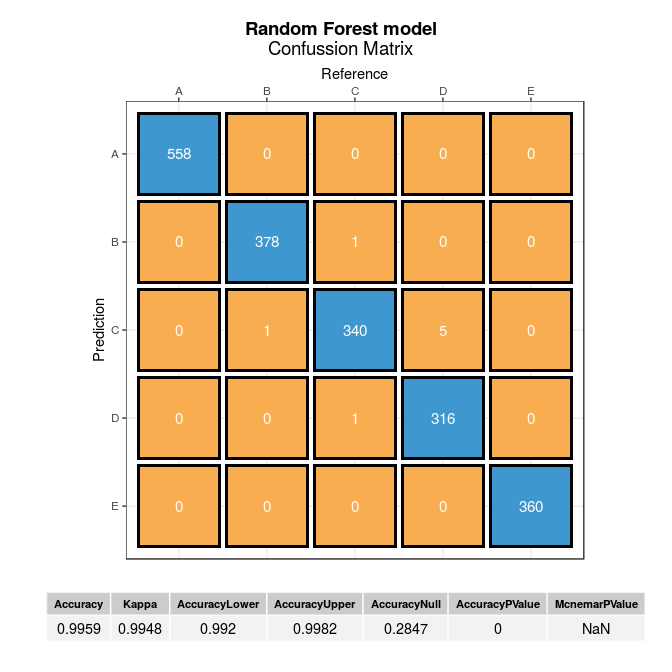
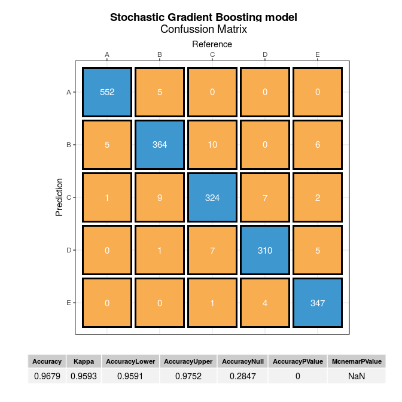

# Machine Learning Project
Jose Ignacio Gómez Marcelo  
31 July 2017  


## Overview
This paper is the result of the Coursera Machine Learning course project and explains the steps that have been taken to adjust a classification model that allows predicting the quality of execution of weight lifting exercises.

The objective is to predict, based on information about the movements performed during weight lifting exercises, that were collected with wereables devices, whether the exercise is being performed correctly (class A) or not (classes B, C, D and E).


## Software
This data analysis was carried out using R, a free software environment for statistical computing and graphics.

```r
sessionInfo()
```

```
## R version 3.4.1 (2017-06-30)
## Platform: x86_64-pc-linux-gnu (64-bit)
## Running under: Ubuntu 16.04.2 LTS
## 
## Matrix products: default
## BLAS: /usr/lib/libblas/libblas.so.3.6.0
## LAPACK: /usr/lib/lapack/liblapack.so.3.6.0
## 
## locale:
##  [1] LC_CTYPE=en_GB.UTF-8       LC_NUMERIC=C              
##  [3] LC_TIME=en_GB.UTF-8        LC_COLLATE=en_GB.UTF-8    
##  [5] LC_MONETARY=en_GB.UTF-8    LC_MESSAGES=en_GB.UTF-8   
##  [7] LC_PAPER=en_GB.UTF-8       LC_NAME=C                 
##  [9] LC_ADDRESS=C               LC_TELEPHONE=C            
## [11] LC_MEASUREMENT=en_GB.UTF-8 LC_IDENTIFICATION=C       
## 
## attached base packages:
## [1] stats     graphics  grDevices utils     datasets  methods   base     
## 
## loaded via a namespace (and not attached):
##  [1] compiler_3.4.1  backports_1.1.0 magrittr_1.5    rprojroot_1.2  
##  [5] tools_3.4.1     htmltools_0.3.6 yaml_2.1.14     Rcpp_0.12.12   
##  [9] stringi_1.1.5   rmarkdown_1.6   knitr_1.16      stringr_1.2.0  
## [13] digest_0.6.12   evaluate_0.10.1
```
Additionally, the packages `lattice`, `ggplot2`, `caret`, `foreach`, `plyr`, `randomForest`, `gbm`, `parallel`, `Iterators`, `doParallel`, `cowplot` and `gridExtra` were used.


```r
library(lattice)
library(ggplot2)
library(caret)
library(foreach)
library(plyr)
library(randomForest)
library(gbm)
library(parallel)
library(iterators)
library(doParallel)
library(cowplot)
library(gridExtra)
```

## Exploratory Analysis and Cleaning
First we download the training and testing datasets.


```r
train_url <- "https://d396qusza40orc.cloudfront.net/predmachlearn/pml-training.csv"
test_url <- "https://d396qusza40orc.cloudfront.net/predmachlearn/pml-testing.csv"
training <- read.csv(train_url)
testing <- read.csv(test_url)
```

Let's take a look at the training dataset.


```r
dim(training)
```

```
## [1] 19622   160
```

We have 19622 observations and 160 variables. Let's see the structure of dataset.


```r
str(training)
```

```
## 'data.frame':	19622 obs. of  160 variables:
##  $ X                       : int  1 2 3 4 5 6 7 8 9 10 ...
##  $ user_name               : Factor w/ 6 levels "adelmo","carlitos",..: 2 2 2 2 2 2 2 2 2 2 ...
##  $ raw_timestamp_part_1    : int  1323084231 1323084231 1323084231 1323084232 1323084232 1323084232 1323084232 1323084232 1323084232 1323084232 ...
##  $ raw_timestamp_part_2    : int  788290 808298 820366 120339 196328 304277 368296 440390 484323 484434 ...
##  $ cvtd_timestamp          : Factor w/ 20 levels "02/12/2011 13:32",..: 9 9 9 9 9 9 9 9 9 9 ...
##  $ new_window              : Factor w/ 2 levels "no","yes": 1 1 1 1 1 1 1 1 1 1 ...
##  $ num_window              : int  11 11 11 12 12 12 12 12 12 12 ...
##  $ roll_belt               : num  1.41 1.41 1.42 1.48 1.48 1.45 1.42 1.42 1.43 1.45 ...
##  $ pitch_belt              : num  8.07 8.07 8.07 8.05 8.07 8.06 8.09 8.13 8.16 8.17 ...
##  $ yaw_belt                : num  -94.4 -94.4 -94.4 -94.4 -94.4 -94.4 -94.4 -94.4 -94.4 -94.4 ...
##  $ total_accel_belt        : int  3 3 3 3 3 3 3 3 3 3 ...
##  $ kurtosis_roll_belt      : Factor w/ 397 levels "","0.000673",..: 1 1 1 1 1 1 1 1 1 1 ...
##  $ kurtosis_picth_belt     : Factor w/ 317 levels "","0.006078",..: 1 1 1 1 1 1 1 1 1 1 ...
##  $ kurtosis_yaw_belt       : Factor w/ 2 levels "","#DIV/0!": 1 1 1 1 1 1 1 1 1 1 ...
##  $ skewness_roll_belt      : Factor w/ 395 levels "","0.000000",..: 1 1 1 1 1 1 1 1 1 1 ...
##  $ skewness_roll_belt.1    : Factor w/ 338 levels "","0.000000",..: 1 1 1 1 1 1 1 1 1 1 ...
##  $ skewness_yaw_belt       : Factor w/ 2 levels "","#DIV/0!": 1 1 1 1 1 1 1 1 1 1 ...
##  $ max_roll_belt           : num  NA NA NA NA NA NA NA NA NA NA ...
##  $ max_picth_belt          : int  NA NA NA NA NA NA NA NA NA NA ...
##  $ max_yaw_belt            : Factor w/ 68 levels "","0.0","-0.1",..: 1 1 1 1 1 1 1 1 1 1 ...
##  $ min_roll_belt           : num  NA NA NA NA NA NA NA NA NA NA ...
##  $ min_pitch_belt          : int  NA NA NA NA NA NA NA NA NA NA ...
##  $ min_yaw_belt            : Factor w/ 68 levels "","0.0","-0.1",..: 1 1 1 1 1 1 1 1 1 1 ...
##  $ amplitude_roll_belt     : num  NA NA NA NA NA NA NA NA NA NA ...
##  $ amplitude_pitch_belt    : int  NA NA NA NA NA NA NA NA NA NA ...
##  $ amplitude_yaw_belt      : Factor w/ 4 levels "","0.00","0.0000",..: 1 1 1 1 1 1 1 1 1 1 ...
##  $ var_total_accel_belt    : num  NA NA NA NA NA NA NA NA NA NA ...
##  $ avg_roll_belt           : num  NA NA NA NA NA NA NA NA NA NA ...
##  $ stddev_roll_belt        : num  NA NA NA NA NA NA NA NA NA NA ...
##  $ var_roll_belt           : num  NA NA NA NA NA NA NA NA NA NA ...
##  $ avg_pitch_belt          : num  NA NA NA NA NA NA NA NA NA NA ...
##  $ stddev_pitch_belt       : num  NA NA NA NA NA NA NA NA NA NA ...
##  $ var_pitch_belt          : num  NA NA NA NA NA NA NA NA NA NA ...
##  $ avg_yaw_belt            : num  NA NA NA NA NA NA NA NA NA NA ...
##  $ stddev_yaw_belt         : num  NA NA NA NA NA NA NA NA NA NA ...
##  $ var_yaw_belt            : num  NA NA NA NA NA NA NA NA NA NA ...
##  $ gyros_belt_x            : num  0 0.02 0 0.02 0.02 0.02 0.02 0.02 0.02 0.03 ...
##  $ gyros_belt_y            : num  0 0 0 0 0.02 0 0 0 0 0 ...
##  $ gyros_belt_z            : num  -0.02 -0.02 -0.02 -0.03 -0.02 -0.02 -0.02 -0.02 -0.02 0 ...
##  $ accel_belt_x            : int  -21 -22 -20 -22 -21 -21 -22 -22 -20 -21 ...
##  $ accel_belt_y            : int  4 4 5 3 2 4 3 4 2 4 ...
##  $ accel_belt_z            : int  22 22 23 21 24 21 21 21 24 22 ...
##  $ magnet_belt_x           : int  -3 -7 -2 -6 -6 0 -4 -2 1 -3 ...
##  $ magnet_belt_y           : int  599 608 600 604 600 603 599 603 602 609 ...
##  $ magnet_belt_z           : int  -313 -311 -305 -310 -302 -312 -311 -313 -312 -308 ...
##  $ roll_arm                : num  -128 -128 -128 -128 -128 -128 -128 -128 -128 -128 ...
##  $ pitch_arm               : num  22.5 22.5 22.5 22.1 22.1 22 21.9 21.8 21.7 21.6 ...
##  $ yaw_arm                 : num  -161 -161 -161 -161 -161 -161 -161 -161 -161 -161 ...
##  $ total_accel_arm         : int  34 34 34 34 34 34 34 34 34 34 ...
##  $ var_accel_arm           : num  NA NA NA NA NA NA NA NA NA NA ...
##  $ avg_roll_arm            : num  NA NA NA NA NA NA NA NA NA NA ...
##  $ stddev_roll_arm         : num  NA NA NA NA NA NA NA NA NA NA ...
##  $ var_roll_arm            : num  NA NA NA NA NA NA NA NA NA NA ...
##  $ avg_pitch_arm           : num  NA NA NA NA NA NA NA NA NA NA ...
##  $ stddev_pitch_arm        : num  NA NA NA NA NA NA NA NA NA NA ...
##  $ var_pitch_arm           : num  NA NA NA NA NA NA NA NA NA NA ...
##  $ avg_yaw_arm             : num  NA NA NA NA NA NA NA NA NA NA ...
##  $ stddev_yaw_arm          : num  NA NA NA NA NA NA NA NA NA NA ...
##  $ var_yaw_arm             : num  NA NA NA NA NA NA NA NA NA NA ...
##  $ gyros_arm_x             : num  0 0.02 0.02 0.02 0 0.02 0 0.02 0.02 0.02 ...
##  $ gyros_arm_y             : num  0 -0.02 -0.02 -0.03 -0.03 -0.03 -0.03 -0.02 -0.03 -0.03 ...
##  $ gyros_arm_z             : num  -0.02 -0.02 -0.02 0.02 0 0 0 0 -0.02 -0.02 ...
##  $ accel_arm_x             : int  -288 -290 -289 -289 -289 -289 -289 -289 -288 -288 ...
##  $ accel_arm_y             : int  109 110 110 111 111 111 111 111 109 110 ...
##  $ accel_arm_z             : int  -123 -125 -126 -123 -123 -122 -125 -124 -122 -124 ...
##  $ magnet_arm_x            : int  -368 -369 -368 -372 -374 -369 -373 -372 -369 -376 ...
##  $ magnet_arm_y            : int  337 337 344 344 337 342 336 338 341 334 ...
##  $ magnet_arm_z            : int  516 513 513 512 506 513 509 510 518 516 ...
##  $ kurtosis_roll_arm       : Factor w/ 330 levels "","0.01388","0.01574",..: 1 1 1 1 1 1 1 1 1 1 ...
##  $ kurtosis_picth_arm      : Factor w/ 328 levels "","-0.00484",..: 1 1 1 1 1 1 1 1 1 1 ...
##  $ kurtosis_yaw_arm        : Factor w/ 395 levels "","-0.01548",..: 1 1 1 1 1 1 1 1 1 1 ...
##  $ skewness_roll_arm       : Factor w/ 331 levels "","-0.00051",..: 1 1 1 1 1 1 1 1 1 1 ...
##  $ skewness_pitch_arm      : Factor w/ 328 levels "","0.00000","-0.00184",..: 1 1 1 1 1 1 1 1 1 1 ...
##  $ skewness_yaw_arm        : Factor w/ 395 levels "","0.00000","-0.00311",..: 1 1 1 1 1 1 1 1 1 1 ...
##  $ max_roll_arm            : num  NA NA NA NA NA NA NA NA NA NA ...
##  $ max_picth_arm           : num  NA NA NA NA NA NA NA NA NA NA ...
##  $ max_yaw_arm             : int  NA NA NA NA NA NA NA NA NA NA ...
##  $ min_roll_arm            : num  NA NA NA NA NA NA NA NA NA NA ...
##  $ min_pitch_arm           : num  NA NA NA NA NA NA NA NA NA NA ...
##  $ min_yaw_arm             : int  NA NA NA NA NA NA NA NA NA NA ...
##  $ amplitude_roll_arm      : num  NA NA NA NA NA NA NA NA NA NA ...
##  $ amplitude_pitch_arm     : num  NA NA NA NA NA NA NA NA NA NA ...
##  $ amplitude_yaw_arm       : int  NA NA NA NA NA NA NA NA NA NA ...
##  $ roll_dumbbell           : num  13.1 13.1 12.9 13.4 13.4 ...
##  $ pitch_dumbbell          : num  -70.5 -70.6 -70.3 -70.4 -70.4 ...
##  $ yaw_dumbbell            : num  -84.9 -84.7 -85.1 -84.9 -84.9 ...
##  $ kurtosis_roll_dumbbell  : Factor w/ 398 levels "","0.0016","-0.0035",..: 1 1 1 1 1 1 1 1 1 1 ...
##  $ kurtosis_picth_dumbbell : Factor w/ 401 levels "","0.0045","0.0130",..: 1 1 1 1 1 1 1 1 1 1 ...
##  $ kurtosis_yaw_dumbbell   : Factor w/ 2 levels "","#DIV/0!": 1 1 1 1 1 1 1 1 1 1 ...
##  $ skewness_roll_dumbbell  : Factor w/ 401 levels "","0.0011","0.0014",..: 1 1 1 1 1 1 1 1 1 1 ...
##  $ skewness_pitch_dumbbell : Factor w/ 402 levels "","-0.0053","0.0063",..: 1 1 1 1 1 1 1 1 1 1 ...
##  $ skewness_yaw_dumbbell   : Factor w/ 2 levels "","#DIV/0!": 1 1 1 1 1 1 1 1 1 1 ...
##  $ max_roll_dumbbell       : num  NA NA NA NA NA NA NA NA NA NA ...
##  $ max_picth_dumbbell      : num  NA NA NA NA NA NA NA NA NA NA ...
##  $ max_yaw_dumbbell        : Factor w/ 73 levels "","0.0","-0.1",..: 1 1 1 1 1 1 1 1 1 1 ...
##  $ min_roll_dumbbell       : num  NA NA NA NA NA NA NA NA NA NA ...
##  $ min_pitch_dumbbell      : num  NA NA NA NA NA NA NA NA NA NA ...
##  $ min_yaw_dumbbell        : Factor w/ 73 levels "","0.0","-0.1",..: 1 1 1 1 1 1 1 1 1 1 ...
##  $ amplitude_roll_dumbbell : num  NA NA NA NA NA NA NA NA NA NA ...
##   [list output truncated]
```

There are a lot of numeric variables coded like factors. Let's
convert all dependent variables to numeric.


```r
training[,-c(1:7,160)] <- lapply(training[,-c(1:7,160)], function(x) as.numeric(as.character(x)))
```

It seems that the dataset has many missing values (NAs). Let's check it.


```r
table(round(sapply(training[,-c(1:7,160)], function(x) sum(is.na(x))/length(x)), 2))
```

```
## 
##    0 0.98    1 
##   52   94    6
```

There are 94 variables with approximately 98% of missing values (NAs) and 6 variables that have 100%, that is, they have no information.

According to the terminology that Rubin coined to describe the different mechanisms of missing values, it seems that this is a case of Missing Completely at Random (MCAR). It means that the probability that an observation is missing is unrelated to the value of this observation or to the value of any other variables. Perhaps the Razor Inertial Measurement units (IMUs) used to record participants' movements had a problem with some specific movement. Hence the consistency in the frequency of values lost in some of the variables.

Regardless of the method we are going to use to build a classifier, the proportion of missing values is too high to attempt any method of imputation, so we will remove those variables with more than 95% of missing values from the analysis.

We will also drop out the variables referred to the time windows used to record data, since, at first glance, they do not seem to be relevant as predictors. And we are also going to take out of the analysis the variable that identifies the user, since we want that the classifier model to be able to identify the quality of the exercise performed, regardless of the characteristics of a specific individual.


```r
feat_sec <- names(training[,-c(1:7,160)])[sapply(training[,-c(1:7,160)], function(x) sum(is.na(x))/length(x)) < 0.9]
training <- training[, c(feat_sec, "classe")]
dim(training)
```

```
## [1] 19622    53
```

After this elimination process we have 52 predictor variables and the outcome `classe`. Let's see if they all have enough variability.


```r
nearZeroVar(training, saveMetrics = TRUE)
```

```
##                      freqRatio percentUnique zeroVar   nzv
## roll_belt             1.101904     6.7781062   FALSE FALSE
## pitch_belt            1.036082     9.3772296   FALSE FALSE
## yaw_belt              1.058480     9.9734991   FALSE FALSE
## total_accel_belt      1.063160     0.1477933   FALSE FALSE
## gyros_belt_x          1.058651     0.7134849   FALSE FALSE
## gyros_belt_y          1.144000     0.3516461   FALSE FALSE
## gyros_belt_z          1.066214     0.8612782   FALSE FALSE
## accel_belt_x          1.055412     0.8357966   FALSE FALSE
## accel_belt_y          1.113725     0.7287738   FALSE FALSE
## accel_belt_z          1.078767     1.5237998   FALSE FALSE
## magnet_belt_x         1.090141     1.6664968   FALSE FALSE
## magnet_belt_y         1.099688     1.5187035   FALSE FALSE
## magnet_belt_z         1.006369     2.3290184   FALSE FALSE
## roll_arm             52.338462    13.5256345   FALSE FALSE
## pitch_arm            87.256410    15.7323412   FALSE FALSE
## yaw_arm              33.029126    14.6570176   FALSE FALSE
## total_accel_arm       1.024526     0.3363572   FALSE FALSE
## gyros_arm_x           1.015504     3.2769341   FALSE FALSE
## gyros_arm_y           1.454369     1.9162165   FALSE FALSE
## gyros_arm_z           1.110687     1.2638875   FALSE FALSE
## accel_arm_x           1.017341     3.9598410   FALSE FALSE
## accel_arm_y           1.140187     2.7367241   FALSE FALSE
## accel_arm_z           1.128000     4.0362858   FALSE FALSE
## magnet_arm_x          1.000000     6.8239731   FALSE FALSE
## magnet_arm_y          1.056818     4.4439914   FALSE FALSE
## magnet_arm_z          1.036364     6.4468454   FALSE FALSE
## roll_dumbbell         1.022388    84.2065029   FALSE FALSE
## pitch_dumbbell        2.277372    81.7449801   FALSE FALSE
## yaw_dumbbell          1.132231    83.4828254   FALSE FALSE
## total_accel_dumbbell  1.072634     0.2191418   FALSE FALSE
## gyros_dumbbell_x      1.003268     1.2282132   FALSE FALSE
## gyros_dumbbell_y      1.264957     1.4167771   FALSE FALSE
## gyros_dumbbell_z      1.060100     1.0498420   FALSE FALSE
## accel_dumbbell_x      1.018018     2.1659362   FALSE FALSE
## accel_dumbbell_y      1.053061     2.3748853   FALSE FALSE
## accel_dumbbell_z      1.133333     2.0894914   FALSE FALSE
## magnet_dumbbell_x     1.098266     5.7486495   FALSE FALSE
## magnet_dumbbell_y     1.197740     4.3012945   FALSE FALSE
## magnet_dumbbell_z     1.020833     3.4451126   FALSE FALSE
## roll_forearm         11.589286    11.0895933   FALSE FALSE
## pitch_forearm        65.983051    14.8557741   FALSE FALSE
## yaw_forearm          15.322835    10.1467740   FALSE FALSE
## total_accel_forearm   1.128928     0.3567424   FALSE FALSE
## gyros_forearm_x       1.059273     1.5187035   FALSE FALSE
## gyros_forearm_y       1.036554     3.7763735   FALSE FALSE
## gyros_forearm_z       1.122917     1.5645704   FALSE FALSE
## accel_forearm_x       1.126437     4.0464784   FALSE FALSE
## accel_forearm_y       1.059406     5.1116094   FALSE FALSE
## accel_forearm_z       1.006250     2.9558659   FALSE FALSE
## magnet_forearm_x      1.012346     7.7667924   FALSE FALSE
## magnet_forearm_y      1.246914     9.5403119   FALSE FALSE
## magnet_forearm_z      1.000000     8.5771073   FALSE FALSE
## classe                1.469581     0.0254816   FALSE FALSE
```

There is no near zero variables, so we can build models with these dataset.

Since we are going to use non-parametric models for the construction of our classifier, we will not test variables' skewness nor will we perform any transformation in them, such as centering or scaling them.

## Classifiers building

In order to test our classifier on a new dataset, before applying it to `testing` dataset, we will split the `training` file into two parts: 90% will be used to train the models (`trainset`), and the remaining 10% to test them (`validset`).


```r
set.seed(42)
train_index <- createDataPartition(y = training$classe, p = .9, list = FALSE)
trainset <- training[train_index,]
validset <- training[-train_index,]
x <- trainset[,-53]
y <- trainset[, 53]
```

### Random Forest

First we are going to train a model with Random Forest algorithm.


```r
cluster <- makeCluster(detectCores() - 1)
registerDoParallel(cluster)
trainfit <- trainControl(method = "cv", number = 5, allowParallel = TRUE)
set.seed(42)
rf_model <- train(x, y, method="rf", trControl = trainfit)
stopCluster(cluster)
registerDoSEQ()
rf_model$finalModel
```

```
## 
## Call:
##  randomForest(x = x, y = y, mtry = param$mtry) 
##                Type of random forest: classification
##                      Number of trees: 500
## No. of variables tried at each split: 2
## 
##         OOB estimate of  error rate: 0.51%
## Confusion matrix:
##      A    B    C    D    E  class.error
## A 5019    3    0    0    0 0.0005973716
## B   13 3400    5    0    0 0.0052662376
## C    0   17 3061    2    0 0.0061688312
## D    0    0   42 2851    2 0.0151986183
## E    0    0    0    6 3241 0.0018478596
```

The Out Of Bag estimation of error rate in this model is 0.5%, a very good figure.

Let's test the model with `validset` and plot the output of confussion matrix.




The accuracy of the model is very good (0.9959). In the movements referred to the class A (exercise done correctly) the model obtains a 100% of hits.

### Stochastic Gradient Boosting with Trees 

No we are going to train another classifier with `gbm` method, from `caret` package.


```r
cluster <- makeCluster(detectCores() - 1)
registerDoParallel(cluster)
set.seed(42)
gbm_model <- train(x, y, method="gbm", trControl = trainfit, verbose = FALSE)
stopCluster(cluster)
registerDoSEQ()
```

And we also check its predictive efficacy in the data set `validset`.




The precision of this model is also very good (0.9679), but it is somewhat lower than that obtained by Random Forest, so we will use this last model to predict the classes of the test dataset.

## Testing phase

Finally we will test the classification model trained with Random Forest in the `testing` dataset.


```r
pred_classes <- predict(rf_model, testing)
pred_classes
```

```
##  [1] B A B A A E D B A A B C B A E E A B B B
## Levels: A B C D E
```

## Appendix: function plot code


```r
plot_mat_conf <- function(mat_conf, title) {
  confussion <- as.data.frame(mat_conf$table)
  confussion$categ <- ifelse(confussion$Freq > 100, "D", "R")
  confussion$categ <- as.factor(confussion$categ)
  myColors <- c("#3F97D0", "#F7AD50")
  names(myColors) <- levels(confussion$categ)
  colScale <- scale_colour_manual(name = "categ", values = myColors)
  
  # build plot confussion matrix
  p1 <- ggplot(confussion, aes(x = Reference, y = Prediction, colour = categ)) + geom_point(shape = 15, cex = 29, colour = "black", show.legend = FALSE) + geom_point(shape = 15, cex = 27, show.legend = FALSE) + scale_x_discrete(name = "Reference", position = "top") + scale_y_discrete(name = "Prediction", limits = rev(levels(confussion$Prediction))) + geom_text(aes(label = sprintf("%1.0f", Freq)), cex = 4, col = "white") + coord_fixed(ratio = 1) + colScale + theme_bw()
  
  # build plot with overall results
  overall <- data.frame(t(round(mat_conf$overall, 4)))
  mytheme <- ttheme_default(core = list(fg_params = list(cex = 0.9)), colhead = list(fg_params = list(cex = 0.7)), rowhead = list(fg_params = list(cex = 0)))
  p2 <- tableGrob(overall, theme = mytheme)
  
  # add subtitle
  p3 <- ggdraw() + draw_label("Confussion Matrix")
  
  # add title
  p4 <- ggdraw() + draw_label(title, fontface='bold')
  
  # add space
  p5 <- ggdraw() + draw_label("")
  
  # plot all
  plot_grid(p5, p4, p3, p1, p2, ncol = 1, rel_heights = c(0.2, 0.2, 0.2, 5, 1))
}
```
